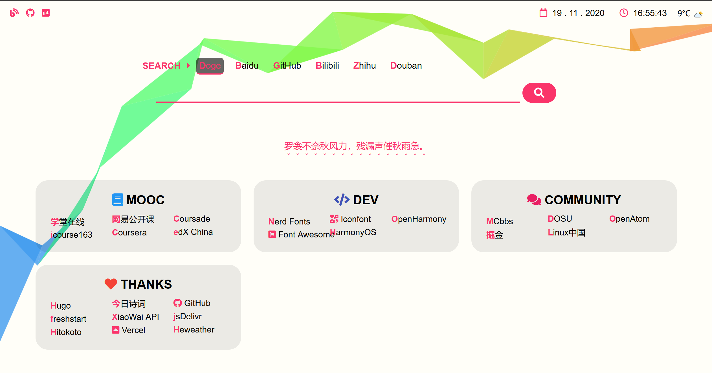
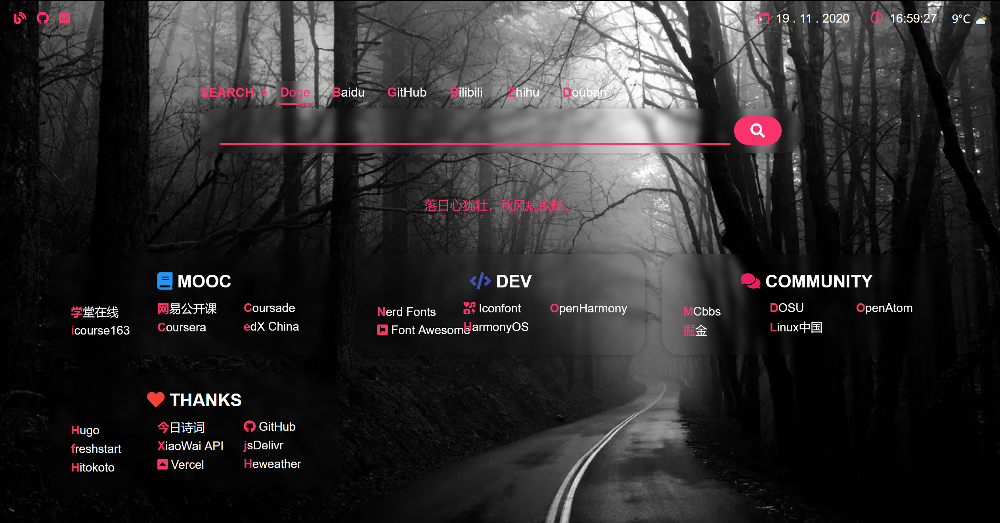

<h1 align="center"> 🚀OriginStart </h1>

<p align="center"> A journey of a thousand miles begins with one step. </p>

---

> [**OriginStart**](https://github.com/SylleoYr/hugo-theme-OriginStart) is a responsive theme for Hugo which is forked and modified from [freshstart](https://github.com/rz3n/hugo-theme-freshstart). OriginStart provides you a clean and easy-to-use start page for your Internet experience.

## Features

- Responsive design
- Custom search engines
- Poetry sentences
- Custom theme color & background
- Blur theme (not compatible with all browsers)
- Weather plugin
- Inject CSS & JS

## Screenshot

**useBlur: false**



**useBlur: true**



## Installation & Usage

### Preconditions

- Basic command line & git skills
- Git installed
- Hugo (version >= 0.74.3) installed
- A text editor you like

### Install the theme

Inside your Hugo site directory run:

```bash
$ git submodule add https://github.com/SylleoYr/hugo-theme-OriginStart themes/OriginStart
```
### Usage

Copy the contents in the `exampleSite` directory into your site root directory, and then:

**To preview:**

```bash
hugo server
```

Then open `http://localhost:1313` in your browser to preview the site.

**To build:**

```bash
hugo
```

It will build the site in the `public` directory.

## Configuration

See [`config.yaml`](./exampleSite/config.yaml).

## Thanks

Thanks to the following projects (unordered):

* [Font Awesome](https://fontawesome.com/icons?d=gallery)
* [Hugo](https://gohugo.io)
* [freshstart](https://github.com/rz3n/hugo-theme-freshstart)
* [Hitokoto](https://hitokoto.cn/)
* [今日诗词](https://www.jinrishici.com/)
* [Heweather](https://www.heweather.com/)
* [ribbon.js](https://github.com/hustcc/ribbon.js)
